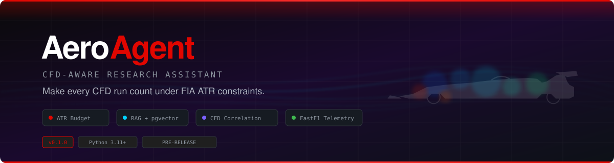

<p align="center">
  
</p>

<p align="center">
  <strong>Multi-Domain F1 Car Development Platform</strong><br/>
  <em>6 domain agents. One goal: make every simulation count.</em>
</p>

<p align="center">
  <a href="#quickstart"></a>
  <a href="#tech-stack"></a>
  <a href="#tech-stack"></a>
  <a href="#tech-stack"></a>
  <a href="#tech-stack"></a>
  <a href="#tech-stack"></a>
  <a href="#tech-stack"></a>
  <a href="#tech-stack"></a>
  <a href="LICENSE"></a>
  <a href="#contributing"></a>
</p>

---

## The Problem

F1 car development spans **6 tightly coupled engineering domains** — aerodynamics, materials, chemistry, structural, thermal, and energy/strategy. A change in one domain cascades into others: a lighter floor (materials) changes flex behavior (structural) which affects downforce (aero) which changes cooling requirements (thermal).

Teams operate under **FIA Aerodynamic Testing Restrictions (ATR)** — every CFD simulation hour is capped based on constructor standings. Similar constraints apply across all simulation types: limited wind tunnel time, restricted dyno hours, and tight development schedules.

**AeroAgent makes every simulation count — across all 6 domains.**

Each domain agent ingests relevant scientific literature, correlates findings with simulation results and on-track telemetry, then produces ranked design modification proposals. The orchestration layer resolves cross-domain trade-offs and ranks proposals by multi-objective Pareto optimality.

```
┌─────────────────────────────────────────────────────────────────┐
│  AERO:  "Literature suggests VGs at 60% chord improve diffuser │
│          performance. Your CFD shows separation at 55% chord.   │
│          Estimated gain: +8 counts Cl_rear. CFD cost: 2 hrs."  │
│                                                                  │
│  THERMAL: "Sidepod redesign reduces cooling drag by 3 counts   │
│            but raises brake duct temps by 12°C. Within limits." │
│                                                                  │
│  MATERIALS: "CFRP layup reorientation saves 0.8kg on floor.    │
│              Requires CFD re-evaluation of flex behavior."      │
│                                                                  │
│  ORCHESTRATOR: Cross-domain rank → VG first (highest ROI),     │
│                then CFRP layup (cascade to aero re-eval)        │
└─────────────────────────────────────────────────────────────────┘
```

---

## Architecture

AeroAgent uses a 4-layer architecture with 6 specialized domain agents. See [ARCHITECTURE.md](ARCHITECTURE.md) for the full specification.

```
┌─────────────────────────────────────────────────────────────────────┐
│  LAYER 4 — RUNTIME (NemoClaw Sandbox)                               │
│  Network isolation · Filesystem restriction · Continuous operation   │
├─────────────────────────────────────────────────────────────────────┤
│  LAYER 3 — ORCHESTRATION (LangGraph State Machine)                  │
│  Cross-domain dependencies · Simulation scheduling · Pareto ranking │
├─────────────────────────────────────────────────────────────────────┤
│  LAYER 2 — DOMAIN AGENTS (AutoResearchClaw 8-Phase Pipeline)        │
│                                                                      │
│  ┌────────┐ ┌──────────┐ ┌──────────┐ ┌──────────┐ ┌───────┐ ┌───┐│
│  │  AERO  │ │MATERIALS │ │CHEMISTRY │ │STRUCTURAL│ │THERMAL│ │ERS││
│  │        │ │          │ │          │ │          │ │       │ │   ││
│  │OpenFOAM│ │Materials │ │Cantera   │ │CalculiX  │ │OF-CHT │ │F1 ││
│  │SU2     │ │Project   │ │RDKit     │ │Code_Aster│ │CoolPrp│ │CAS││
│  │foamlib │ │AFLOW     │ │RMG       │ │preCICE   │ │Elmer  │ │ADi││
│  │PyVista │ │LAMMPS    │ │GROMACS   │ │          │ │       │ │   ││
│  └────────┘ └──────────┘ └──────────┘ └──────────┘ └───────┘ └───┘│
│                                                                      │
│  Each agent: own Qdrant collection · domain schemas · eval metrics  │
├─────────────────────────────────────────────────────────────────────┤
│  LAYER 1 — MCP TOOL LAYER                                           │
│  openfoam-mcp-server · mcp.science · Scite MCP · domain MCP servers│
└─────────────────────────────────────────────────────────────────────┘
```

---

## Tech Stack

AeroAgent uses a modern, production-grade Python stack. Every choice is deliberate.

### Core Infrastructure

| Component | Tool | Why |
|:--|:--|:--|
| **Package Management** | [uv](https://github.com/astral-sh/uv) `>= 0.5` | 10x faster than Poetry. Industry standard for Python in 2025+. |
| **Linting & Formatting** | [Ruff](https://github.com/astral-sh/ruff) `>= 0.9` | Replaces Black, isort, Flake8, and 12 other tools. Millisecond speed. |
| **Type Checking** | [basedpyright](https://github.com/DetachHead/basedpyright) | Stricter, faster alternative to mypy. |
| **Data Validation** | [Pydantic v2](https://docs.pydantic.dev/) `>= 2.10` | Rust core. 5-50x faster than v1. |
| **Testing** | [pytest](https://docs.pytest.org/) `>= 8.0` | With `pytest-asyncio`, `pytest-cov`, `pytest-mock`, `pytest-xdist`. |
| **API** | [FastAPI](https://fastapi.tiangolo.com/) `>= 0.115` | Async, Pydantic-native, OpenAPI docs. |

### AI / RAG Pipeline

| Component | Tool | Why |
|:--|:--|:--|
| **RAG Framework** | [LlamaIndex](https://docs.llamaindex.ai/) `>= 0.11` | Best ingestion/retrieval for scientific docs. 150+ connectors. |
| **Orchestration** | [LangGraph](https://langchain-ai.github.io/langgraph/) `>= 0.2` | Stateful graph workflows for multi-step correlation and cross-domain orchestration. |
| **LLM Gateway** | [LiteLLM](https://github.com/BerriAI/litellm) `>= 1.55` | Unified API across GPT-4o + Claude. Cost tracking, fallback routing. |
| **Vector Database** | [Qdrant](https://qdrant.tech/) `>= 1.12` | Rich payload filtering for domain metadata (Cd, Cl, flow regime, Re, material properties). |
| **Relational DB** | [PostgreSQL](https://www.postgresql.org/) `>= 16` | ATR budget tracking, simulation run history, telemetry sessions. |
| **Embeddings** | Cohere embed-v4 / [Jina v3](https://jina.ai/embeddings/) | Top MTEB scores. Jina v3's late chunking preserves cross-section context in papers. |
| **PDF Parsing** | [Docling](https://github.com/docling-project/docling) `>= 2.0` | IBM Granite VLM. Best structural extraction for scientific PDFs (tables, equations, figures). |
| **PDF Fallback** | [Marker](https://github.com/VikParuchuri/marker) `>= 1.0` | Fast GPU/MPS batch processing for bulk paper ingestion. |

### Aerodynamics

| Component | Tool | Why |
|:--|:--|:--|
| **F1 Telemetry** | [FastF1](https://docs.fastf1.dev/) `>= 3.8` | De facto standard for F1 timing/telemetry data. |
| **OpenFOAM Parsing** | [foamlib](https://github.com/gerlero/foamlib) `>= 1.2` | Modern, typed, async. Published in JOSS 2025. |
| **SU2 Parsing** | pysu2 (native) + pandas | SU2's native Python wrapper + CSV force history parsing. |
| **CFD Visualization** | [PyVista](https://docs.pyvista.org/) `>= 0.47` | Pythonic VTK wrapper. Reads VTK, STL, OpenFOAM, CGNS. Used at NASA. |
| **Paper Discovery** | [OpenAlex](https://openalex.org/) + [Semantic Scholar](https://www.semanticscholar.org/) + [arXiv](https://arxiv.org/) | OpenAlex for broad discovery, S2 for citation graphs, arXiv for preprints. |
| **Surrogate Models** | [DeepXDE](https://deepxde.readthedocs.io/) `>= 1.15` (prototype) / [NVIDIA PhysicsNeMo](https://github.com/NVIDIA/physicsnemo) (production) | PINNs for prototype. FNO-based surrogates via PhysicsNeMo for production. |

### Multi-Domain Tools

| Domain | Tools | Purpose |
|:--|:--|:--|
| **Materials** | [Materials Project API](https://materialsproject.org/), [AFLOW](http://aflow.org/), LAMMPS | Material property database, crystal structure search, molecular dynamics |
| **Chemistry** | [Cantera](https://cantera.org/), [RDKit](https://www.rdkit.org/), [RMG](https://rmg.mit.edu/), GROMACS | Combustion kinetics, molecular properties, reaction mechanisms, MD |
| **Structural** | [CalculiX](http://www.calculix.de/), [Code_Aster](https://www.code-aster.org/), [preCICE](https://precice.org/) | FEA stress/fatigue, advanced FEA, fluid-structure interaction coupling |
| **Thermal** | OpenFOAM CHT, [CoolProp](http://www.coolprop.org/), [Elmer](https://www.csc.fi/web/elmer) | Conjugate heat transfer, thermodynamic properties, multiphysics |
| **ERS/Strategy** | [CasADi](https://web.casadi.org/), [OpenMDAO](https://openmdao.org/), [Gymnasium](https://gymnasium.farama.org/) | Optimal control, multidisciplinary optimization, RL for strategy |

### Agent Infrastructure

| Component | Tool | Purpose |
|:--|:--|:--|
| **Research Pipeline** | [AutoResearchClaw](https://github.com/TechxGenus/AutoResearchClaw) | 8-phase autonomous research-to-report pipeline |
| **Agent Runtime** | NemoClaw | Sandboxed always-on agent runtime with network isolation |
| **MCP Servers** | openfoam-mcp-server, mcp.science, Scite MCP | Simulation tool access via Model Context Protocol |
| **Dashboard** | [Streamlit](https://streamlit.io/) (MVP) / [Plotly Dash](https://dash.plotly.com/) (production) | Rapid prototyping → complex engineering dashboards |

### LLM Routing Strategy

| Task | Model | Rationale |
|:--|:--|:--|
| Paper analysis & structured extraction | GPT-4o | Strong structured output, reliable JSON |
| CFD result interpretation | Claude Sonnet | Nuanced reasoning over numerical data |
| Regulation parsing | Claude Sonnet | Long-context precision |
| Quick metadata queries | GPT-4o-mini | Cost-efficient for simple lookups |
| Surrogate model code generation | Claude Sonnet | Superior code generation |

Routing is handled by LiteLLM proxy with tag-based model groups — the application code calls a single endpoint.

---

## Project Structure

```
aero-agent/
├── pyproject.toml                      # uv-managed, PEP 735 dependency groups
├── ARCHITECTURE.md                     # Full architecture specification
├── README.md
├── LICENSE
├── assets/
│   └── banner.svg
├── src/
│   └── aero_agent/
│       ├── __init__.py
│       ├── main.py                     # FastAPI application entrypoint
│       ├── config.py                   # Pydantic Settings configuration
│       │
│       ├── domains/                    # 6 domain agents
│       │   ├── base.py                 # Base domain agent (AutoResearchClaw pipeline)
│       │   ├── aero/                   # Aerodynamics: OpenFOAM, SU2, foamlib, PyVista
│       │   │   ├── agent.py
│       │   │   ├── scanner.py
│       │   │   ├── paper_analyzer.py
│       │   │   ├── cfd_parser.py
│       │   │   ├── force_analyzer.py
│       │   │   ├── flow_detector.py
│       │   │   ├── design_modifier.py
│       │   │   ├── budget_tracker.py
│       │   │   └── schemas.py
│       │   ├── materials/              # Materials: MatProject, AFLOW, LAMMPS
│       │   │   ├── agent.py
│       │   │   ├── matproject_client.py
│       │   │   ├── aflow_client.py
│       │   │   ├── lammps_runner.py
│       │   │   └── schemas.py
│       │   ├── chemistry/              # Chemistry: Cantera, RDKit, RMG
│       │   │   ├── agent.py
│       │   │   ├── cantera_runner.py
│       │   │   ├── rdkit_analyzer.py
│       │   │   ├── rmg_client.py
│       │   │   └── schemas.py
│       │   ├── structural/             # Structural: CalculiX, Code_Aster, preCICE
│       │   │   ├── agent.py
│       │   │   ├── calculix_runner.py
│       │   │   ├── precice_coupler.py
│       │   │   └── schemas.py
│       │   ├── thermal/                # Thermal: OpenFOAM CHT, CoolProp, Elmer
│       │   │   ├── agent.py
│       │   │   ├── cht_runner.py
│       │   │   ├── coolprop_client.py
│       │   │   └── schemas.py
│       │   └── ers/                    # ERS/Strategy: CasADi, OpenMDAO, Gymnasium
│       │       ├── agent.py
│       │       ├── casadi_optimizer.py
│       │       ├── openmda_runner.py
│       │       ├── strategy_env.py
│       │       └── schemas.py
│       │
│       ├── research/                   # AutoResearchClaw 8-phase pipeline
│       │   ├── pipeline.py
│       │   ├── scoping.py              # Phase A
│       │   ├── discovery.py            # Phase B
│       │   ├── synthesis.py            # Phase C
│       │   ├── design.py               # Phase D
│       │   ├── execution.py            # Phase E
│       │   ├── analysis.py             # Phase F
│       │   ├── writing.py              # Phase G
│       │   └── finalization.py         # Phase H
│       │
│       ├── orchestration/              # LangGraph state machine
│       │   ├── graph.py
│       │   ├── dependency_resolver.py
│       │   ├── conflict_resolver.py
│       │   ├── scheduler.py
│       │   └── pareto_ranker.py
│       │
│       ├── mcp/                        # MCP server clients
│       │   ├── openfoam_mcp.py
│       │   ├── science_mcp.py
│       │   └── scite_mcp.py
│       │
│       ├── runtime/                    # NemoClaw integration (Phase 5)
│       │   ├── sandbox.py
│       │   ├── inference_router.py
│       │   └── monitor.py
│       │
│       ├── literature/                 # Shared literature utilities
│       │   ├── knowledge_base.py
│       │   ├── regulation_parser.py
│       │   └── citation_verifier.py
│       │
│       ├── correlation/
│       │   ├── lit_to_sim.py
│       │   ├── telemetry_validator.py
│       │   └── insight_ranker.py
│       │
│       ├── telemetry/
│       │   ├── fastf1_client.py
│       │   ├── speed_trace.py
│       │   └── aero_balance.py
│       │
│       └── api/
│           ├── routes.py
│           └── schemas.py
│
├── tests/
│   ├── conftest.py
│   ├── test_domains/
│   │   ├── test_aero/
│   │   ├── test_materials/
│   │   ├── test_chemistry/
│   │   ├── test_structural/
│   │   ├── test_thermal/
│   │   └── test_ers/
│   ├── test_research/
│   ├── test_orchestration/
│   ├── test_correlation/
│   └── test_telemetry/
│
├── data/
│   ├── regulations/                    # FIA technical regulation PDFs
│   ├── aero_knowledge_base/            # Seeded aero papers and reference material
│   ├── reference_geometries/           # Open-source simplified F1 geometry
│   └── chemistry/
│       └── mechanisms/                 # Cantera reaction mechanism files
│
├── scripts/
│   ├── scan_papers.py
│   ├── ingest_cfd_results.py
│   └── correlate_telemetry.py
│
└── docker/
    ├── Dockerfile
    └── docker-compose.yml              # Qdrant + PostgreSQL + AeroAgent
```

---

## Quickstart

### Prerequisites

- Python 3.11+
- [uv](https://docs.astral.sh/uv/getting-started/installation/) (package manager)
- Docker (for Qdrant + PostgreSQL)

### Installation

```bash
# Clone the repository
git clone https://github.com/your-username/aero-agent.git
cd aero-agent

# Install dependencies
uv sync

# Start infrastructure (Qdrant + PostgreSQL)
docker compose -f docker/docker-compose.yml up -d

# Copy and configure environment
cp .env.example .env
# Edit .env with your API keys (OpenAI, Anthropic, Cohere, Materials Project, etc.)

# Run the application
uv run python -m aero_agent.main
```

### First Steps

```bash
# 1. Scan and ingest aerodynamics papers
uv run python scripts/scan_papers.py --query "ground effect diffuser F1" --limit 50

# 2. Ask a question
curl -X POST http://localhost:8000/api/query \
  -H "Content-Type: application/json" \
  -d '{"question": "What does recent research suggest about diffuser optimization for ground effect cars?"}'

# 3. Ingest CFD results (OpenFOAM example)
uv run python scripts/ingest_cfd_results.py --case-dir ./data/cfd_runs/baseline/

# 4. Get ranked design suggestions
curl -X POST http://localhost:8000/api/suggestions \
  -H "Content-Type: application/json" \
  -d '{"component": "diffuser", "budget_hours": 10}'
```

---

## Roadmap

### Phase 1 — Literature MVP (8 weeks)

- [ ] Multi-source paper scanner (OpenAlex, Semantic Scholar, arXiv)
- [ ] PDF parsing pipeline (Docling + Marker fallback)
- [ ] LLM-powered insight extraction parameterized by domain
- [ ] RAG knowledge base with Qdrant (hybrid vector + metadata search)
- [ ] FIA regulation parser
- [ ] FastF1 telemetry integration
- [ ] Natural language query API
- [ ] Streamlit dashboard (MVP)

### Phase 2 — Aero Agent (10 weeks)

- [ ] CFD result parser (OpenFOAM via foamlib, SU2 via pysu2)
- [ ] Flow feature detection (separation, vortex structures)
- [ ] Literature-CFD correlation engine
- [ ] Telemetry-CFD validation pipeline (FastF1)
- [ ] Design suggestion generator with ROI ranking
- [ ] ATR budget optimization with dynamic ROI thresholds
- [ ] PyVista-powered flow visualization
- [ ] AutoResearchClaw 8-phase pipeline for aero domain

### Phase 3 — Materials + Chemistry Agents (8 weeks)

- [ ] Materials Agent (Materials Project, AFLOW, LAMMPS)
- [ ] Chemistry Agent (Cantera, RDKit, RMG)
- [ ] Domain-specific Qdrant collections and schemas
- [ ] Cross-domain dependency handling
- [ ] MCP servers for mcp.science, Cantera, CalculiX

### Phase 4 — Structural + Thermal + ERS Agents (8 weeks)

- [ ] Structural Agent (CalculiX, Code_Aster, preCICE)
- [ ] Thermal Agent (OpenFOAM CHT, CoolProp, Elmer)
- [ ] ERS/Strategy Agent (CasADi, OpenMDAO, Gymnasium)
- [ ] Full cross-domain dependency graph
- [ ] Multi-objective Pareto ranking across all 6 domains
- [ ] LangGraph orchestration for conflict resolution

### Phase 5 — NemoClaw Integration (6 weeks)

- [ ] NemoClaw sandbox deployment
- [ ] Network isolation and filesystem restriction
- [ ] Continuous overnight simulation campaigns
- [ ] MetaClaw-style cross-run learning
- [ ] Surrogate model training (DeepXDE → PhysicsNeMo)

---

## Key Concepts

### ATR Budget Optimization

The FIA allocates CFD hours based on constructor championship position — the lower you finish, the more hours you get. As budget depletes, AeroAgent exponentially increases the ROI threshold for proposed simulations:

```python
def roi_threshold(utilization: float) -> float:
    """Require higher ROI as budget depletes."""
    return 1.0 + 2.0 * (utilization ** 2)
    # At 50% used: threshold = 1.5
    # At 80% used: threshold = 2.28
    # At 95% used: threshold = 2.80
```

### Literature-CFD Correlation

AeroAgent doesn't just find relevant papers — it correlates literature insights with your actual CFD data and on-track performance:

```
Literature says:  "VGs at 60% chord → +3-5% diffuser Cl"
Your CFD shows:   Separation onset at 55% chord
Telemetry shows:  Rear instability above 280 km/h
━━━━━━━━━━━━━━━━━━━━━━━━━━━━━━━━━━━━━━━━━━━━━━━
Suggestion:       Add VG array at 58% chord on diffuser
Expected gain:    +8 counts Cl_rear
CFD cost:         2 ATR-hours
Confidence:       HIGH (3 corroborating sources)
```

### Cross-Domain Dependency Resolution

When domain agents propose conflicting changes, the orchestration layer resolves trade-offs:

```
AERO wants:      Thinner rear wing endplate (less drag)
STRUCTURAL needs: Minimum 3mm thickness for stiffness
THERMAL says:     Thinner section reduces heat soak from exhaust
━━━━━━━━━━━━━━━━━━━━━━━━━━━━━━━━━━━━━━━━━━━━━━━━━━━━━━━━━━━
Resolution:       2.5mm CFRP with optimized layup → meets structural
                  requirement at reduced weight. Aero + thermal benefit.
                  Combined ROI: 3.8 (Pareto-optimal across 3 domains)
```

### Hybrid RAG Search

Papers are indexed with both vector embeddings and structured metadata, enabling queries like:

> "Find papers about vortex shedding on front wing endplates at Re > 5x10^6 published after 2022"

This combines semantic similarity (vector) with exact metadata filtering (Re, year, component) — powered by Qdrant's payload filtering during HNSW search.

---

## Target Users

| User | Use Case |
|:--|:--|
| **F1 Aero Departments** | Maximize aerodynamic gains per ATR-hour across development cycles |
| **Materials Engineers** | Optimize CFRP layups, explore novel composites, reduce mass |
| **Powertrain Engineers** | Fuel formulation, lubricant optimization, ERS deployment strategy |
| **Race Strategists** | Energy deployment optimization, tire strategy, active aero decisions |
| **Formula E Teams** | Literature-driven design optimization under tighter budgets |
| **Motorsport Consultancies** | Rapid literature review and simulation prioritization for clients |
| **University FSAE Teams** | Access professional-grade research tooling on student budgets |
| **Aero Researchers** | Structured knowledge base of aerodynamics literature with CFD context |

---

## Success Metrics

| Metric | Target | Phase |
|:--|:--|:--|
| Literature coverage | Index >500 relevant aero papers with structured insights | 1 |
| Query quality | >75% of RAG answers rated "relevant and accurate" by engineers | 1 |
| Suggestion quality | >50% of design proposals deemed "worth investigating" | 2 |
| Telemetry correlation | CFD-to-track: within 2% for drag, 5% for downforce | 2 |
| Materials accuracy | Property predictions within 10% of experimental values | 3 |
| Chemistry accuracy | Combustion sims within 5% of dyno measurements | 3 |
| FEA correlation | Stress predictions within 8% of physical test results | 4 |
| Thermal accuracy | Temperature predictions within 5C of track measurements | 4 |
| Cross-domain proposals | >30% of proposals span multiple domains | 4 |
| Autonomous uptime | >95% continuous operation over 24-hour campaigns | 5 |

---

## Contributing

Contributions are welcome. See [CONTRIBUTING.md](CONTRIBUTING.md) for guidelines.

```bash
# Development setup
uv sync --group dev --group test
uv run ruff check .
uv run pytest
```

---

## License

MIT License. See [LICENSE](LICENSE) for details.

---

<p align="center">
  <sub>Built for the engineers who make 0.001s count.</sub>
</p>
